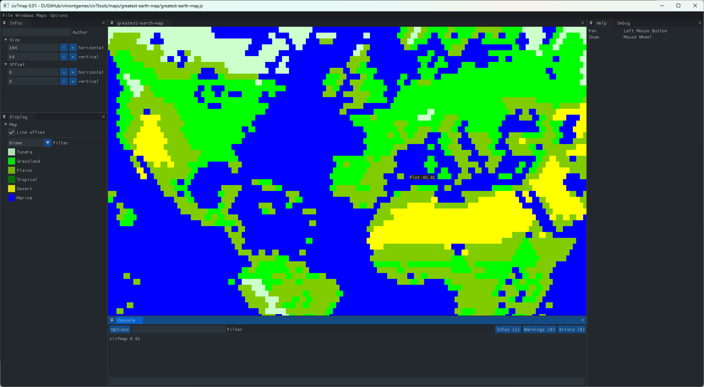

civ7map
-----

An unofficial map editor for Civilization VII.

# Build
Open civ7tools.sln using Visual Studio 2022 (free version can be downloaded [here](https://visualstudio.microsoft.com/downloads/)), selection $(SolutionDir) as the working directory, then build solution.

# Changelog

## v0.01

- Import terrain type from .js (Civ VII) or .lua (Civ VI) files (Civ VI terrain tiles are then converted to Civ VII's TerrainType and biome)
- Picking terrain plots

# Dependencies

* [SFML](https://github.com/SFML/SFML) >= 2.5.1 (*)
* [Dear ImGui](https://github.com/ocornut/imgui) >= 1.80
* [ImGui-SFML](https://github.com/eliasdaler/imgui-sfml) >= 2.3+
* [ImGui-Addons](https://github.com/wflohry/imgui-addons)
* [miniz-cpp](https://github.com/tfussell/miniz-cpp)
* [TinyXML-2](https://github.com/leethomason/tinyxml2)
* [Base64](https://github.com/terrakuh/base64)
* [stb](https://github.com/nothings/stb)

(*) All dependencies but the SFML have been copied to this repo, you will need to set an environment variable named $(SFML) pointing to your SFML install in order to compile.

e.g. **SFML=G:\SFML\SFML-2.5.1**
