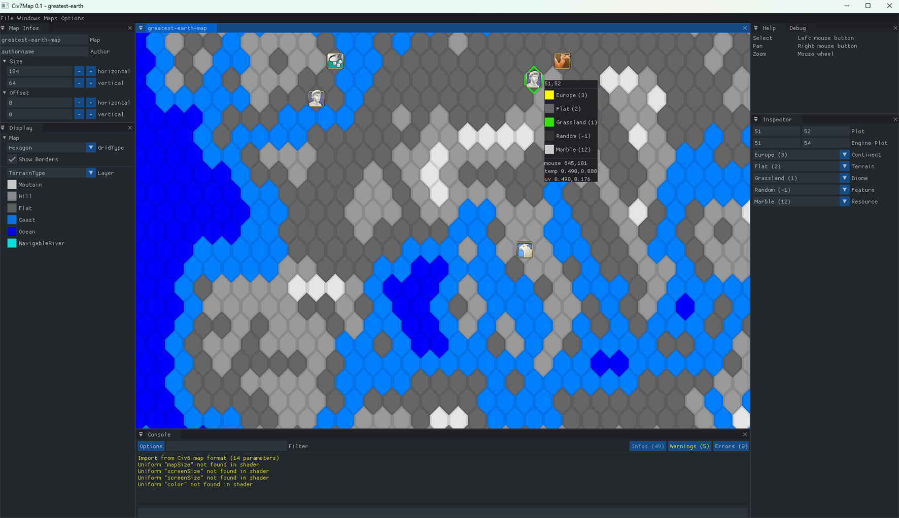

civ7map
-----

An unofficial map editor for Civilization VII.

# How to use?

## Create new map

TODO

## Load existing map

TODO

## Save map

TODO

## Mouse

| Key                | Description |
|--------------------|-------------|
| Left mouse button  | Paint       |
| Right mouse button | Pan camera  |
| Mouse wheel        | Zoom        |

## Keyboard

| Key                | Description |
|--------------------|-------------|
| Space              | Select plot |
| Ctrl-Z             | Undo        |
| Ctrl-Y             | Redo        |

# Build
If you want to compile the tool yourself rather than using a released version, open civ7tools.sln using Visual Studio 2022 (free version can be downloaded [here](https://visualstudio.microsoft.com/downloads/)), selection $(SolutionDir) as the working directory, then build solution.

# Changelog

- Create map from scratch using YnAMP's

## v0.1

- Resource icons
- Create new map from scratch using [Gedemon](https://github.com/Gedemon)'s YnAMP map mod template 

## v0.02

- Add support for 'GetMap' being imported from a separate file
- Separate parsing map data and Civ6 => Civ7 tile format conversion
- Import continents and resources

## v0.01

- Import terrain type from .js (Civ VII) or .lua (Civ VI) files (Civ VI terrain tiles are then converted to Civ VII's TerrainType and biome)
- Picking terrain plots

# Dependencies

* [SFML](https://github.com/SFML/SFML) >= 2.5.1 (*)
* [Dear ImGui](https://github.com/ocornut/imgui) >= 1.80
* [ImGui-SFML](https://github.com/eliasdaler/imgui-sfml) >= 2.3+
* [ImGui-Addons](https://github.com/wflohry/imgui-addons)
* [miniz-cpp](https://github.com/tfussell/miniz-cpp)
* [TinyXML-2](https://github.com/leethomason/tinyxml2)
* [Base64](https://github.com/terrakuh/base64)
* [stb](https://github.com/nothings/stb)
* [magic__enum](https://github.com/Neargye/magic_enum)
* [fmt](https://github.com/fmtlib/fmt/)

(*) All dependencies but the SFML have been copied to this repo, you will need to set an environment variable named $(SFML) pointing to your SFML install in order to compile.

e.g. **SFML=G:\SFML\SFML-2.5.1**
